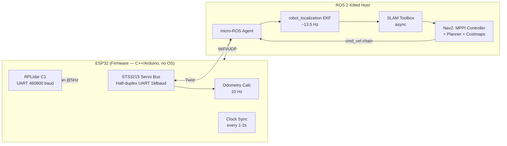

# Autonomous SLAM Rover

**A ground-up autonomous mobile robot** — ESP32 firmware, LiDAR-based SLAM, and Nav2 path planning, integrated on hobby-grade hardware with no operating system on the embedded side.

`ESP32` `micro-ROS` `ROS 2 Kilted` `SLAM Toolbox` `Nav2 / MPPI` `C++` `Python`

[Demo video](https://youtube.com/shorts/VPZTrOBSdS8?feature=share) · [Chassis CAD (Onshape)](https://cad.onshape.com/documents/83125d1df7da4e076211cfb5/w/6ad0806186d95563e5e967b6/e/4eaaa43f1ce4cf23ad352b7c)

---

## Overview

This rover maps and navigates unknown indoor environments in real time using 2D LiDAR SLAM. The embedded platform is deliberately constrained: an ESP32 microcontroller — no OS, WiFi-only, limited compute — bridged to a full ROS 2 navigation stack over `micro-ROS`. That constraint was the point. A Raspberry Pi would have made this easier and less interesting; the ESP32 forced real engineering around clock synchronization, wireless message loss, and firmware-level motor control that a more capable board would have hidden.

The system achieved **stable real-time SLAM** (10 Hz on both `/scan` and `/odom`, σ ≈ 0.05 Hz), reliable short-term obstacle avoidance, and autonomous goal navigation — after resolving a chain of failures that spanned firmware, transforms, and navigation-stack configuration. That debugging process is the actual substance of this project, and it's documented below.

## System Architecture

## Engineering Challenges

Four problems that best represent the actual debugging work on this project — root cause, fix, and reasoning for each.

### 1. Controller loop silently running at 2 Hz instead of 10 Hz
- **Symptom:** Navigation was sluggish and oscillated near goals — the robot consistently overshot turns before correcting.
- **Diagnosis:** Traced the full `cmd_vel` pipeline with `ros2 topic hz` at each hop (`controller_server → cmd_vel_nav → velocity_smoother → cmd_vel_smoothed → collision_monitor → cmd_vel`) and found messages dying between two nodes.
- **Root cause:** ROS 2 Kilted defaults `behavior_server` to `TwistStamped`, while the ESP32 firmware subscribed to plain `Twist`. Both message types were present on the same topic; ROS 2 subscribers reject mismatched types silently — no error, no warning, just missing messages.
- **Fix:** Set `enable_stamped_cmd_vel: false` across all velocity-publishing nodes to force a consistent type through the entire chain.

### 2. Asymmetric wheel speeds from a firmware-level bug
- **Symptom:** The rover drifted during commands that should have driven it straight.
- **Diagnosis:** Isolated the fault to the motor driver layer rather than kinematics or odometry by commanding raw wheel speeds directly and observing the asymmetry persist.
- **Root cause:** The Feetech STS servo library's `WriteSpe()` expects a signed 16-bit integer for direction encoding. An earlier implementation manually manipulated the sign bit instead, corrupting speed commands in a way that only showed up as inconsistent — not obviously wrong — motion.
- **Fix:** Replaced manual bit manipulation with correct signed-integer calls.

### 3. Stale transforms from ESP32↔host clock drift (up to 592ms)
- **Symptom:** Intermittent `TF extrapolation error` and Nav2's error 102 ("unable to transform goal into costmap frame"), especially during in-place rotation.
- **Diagnosis:** An embedded microcontroller with no OS and no NTP-equivalent drifts against the host clock. That drift invalidated timestamps used by SLAM and TF lookups.
- **Fix:** Increased `transform_tolerance` to 1.0s across every Nav2 component *and* every costmap (they perform independent TF lookups with their own default tolerances), and increased ESP32 clock re-sync frequency via `rmw_uros_sync_session()`. Both were necessary — tolerance absorbs transient drift, faster sync prevents accumulation.

### 4. Effective track width diverging from physical measurement
- **Symptom:** Odometry-based heading was consistently wrong despite correct physical wheel spacing.
- **Diagnosis:** Commanded a 1080° (3-rotation) spin-in-place test and measured actual angle turned, isolating pure kinematic error from lag-induced error (a single-rotation test conflates the two).
- **Root cause:** Wheel slip during in-place rotation on hard flooring means the *effective* kinematic track width is larger than the physically measured wheel-to-wheel distance — expected behavior for differential drive, but only quantifiable empirically.
- **Fix:** Scaled `TRACK_WIDTH` proportionally (`new = old × actual_angle / commanded_angle`) from 0.18m to 0.1875m, confirmed by re-running the test.

*A full issue-and-resolution log covering 15+ additional bugs across odometry, SLAM Toolbox tuning, and Nav2 parameter configuration is in [`/docs/postmortem.pdf`](./docs/postmortem.pdf).*

## Results

| Metric | Result |
|---|---|
| `/scan`, `/odom` publish rate | 10 Hz stable (σ ≈ 0.05 Hz) |
| Odometry | Empirically calibrated, EKF-fused via `robot_localization` |
| Mapping | Coherent occupancy grids via SLAM Toolbox during teleop and autonomous nav |
| Navigation | Collision-free MPPI trajectories; autonomous goal-reaching functional but sensitive to clock drift during extended runs |

## Repository Structure

- `main` — mapping-only functionality
- `nav2-integration` — full autonomous navigation stack as described above

## Hardware

| Component | Spec |
|---|---|
| Compute | ESP32-S (NodeMCU form factor) |
| LiDAR | RPLidar C1, 360°, up to 12m, UART @ 460800 baud |
| Actuation | 2× Feetech STS3215 serial bus servos, differential drive |
| Power | 5V/3A bank (logic/LiDAR), 2S 18650 7.4V pack (servo bus) |

## Future Work

- Migrate to Raspberry Pi 4 to eliminate the WiFi/clock-drift problem class entirely and free compute headroom for SLAM + Nav2 + MPPI running concurrently
- IMU fusion into the EKF to reduce rotational odometry error from wheel slip
- Separate mapping and localization phases for more predictable production-style navigation
- Direct quadrature encoder feedback in place of servo absolute-position polling

## Setup

Full installation, wiring, and build instructions are in [`/docs/postmortem.pdf`](./docs/postmortem.pdf) (§6). Requires ROS 2 Kilted on Ubuntu 24.04, Arduino IDE 2.3.4, and the micro-ROS Arduino library.
